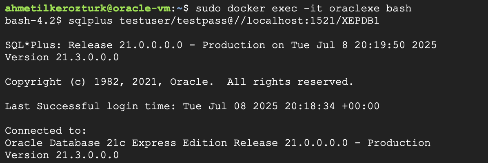
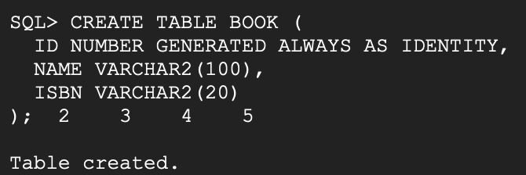
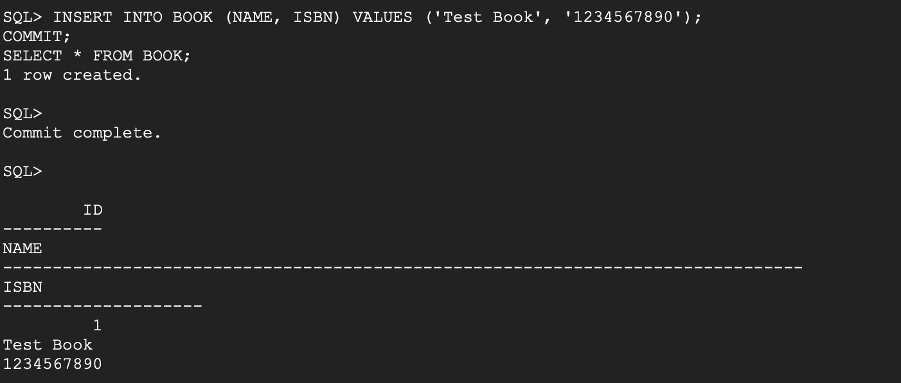

Tabii, sana temiz, açıklayıcı ve düzgün bir İngilizce readme.md örneği hazırlıyorum.
Ekran görüntülerini ekleyeceğin yerleri de not ettim, kod bloklarını da ```bash ile açıyorum.

⸻


# Oracle XE - Create and Use a Table (BOOK)

This guide explains how to create a table in Oracle Database 21c XE (running in Docker), insert a record, and query the data using SQL*Plus in a Linux terminal.

---

## 1. Connect to the Container and SQL*Plus

Open a bash shell in the running Oracle container and start SQL*Plus as your test user.

```bash
sudo docker exec -it oraclexe bash
sqlplus testuser/testpass@//localhost:1521/XEPDB1
```
Screenshot:



⸻

## 2. Create the Table

Run the following command in SQL*Plus to create the BOOK table:
```sql
CREATE TABLE BOOK (
  ID NUMBER GENERATED ALWAYS AS IDENTITY,
  NAME VARCHAR2(100),
  ISBN VARCHAR2(20)
);
```

Screenshot:




⸻

## 3. Insert a Record and Commit

Insert a sample record into the table, commit the transaction, and query the table:
```sql
INSERT INTO BOOK (NAME, ISBN) VALUES ('Test Book', '1234567890');
COMMIT;
SELECT * FROM BOOK;
```
Screenshot:



⸻

## 4. Output Example

You should see output similar to the following when you run SELECT * FROM BOOK;:
```
        ID
----------
NAME
--------------------------------------------------------------------------------
ISBN
--------------------
         1
Test Book
1234567890
```


⸻

Notes
	•	Make sure you are connected to the pluggable database (XEPDB1), not the root.
	•	If you get privilege or quota errors, ensure your user has the correct permissions/quota.
	•	Always commit your changes to make inserts permanent.

⸻

That’s it!
Now you have a working BOOK table in your Oracle XE instance running in Docker.
You can repeat these steps for more tables and data.

---
